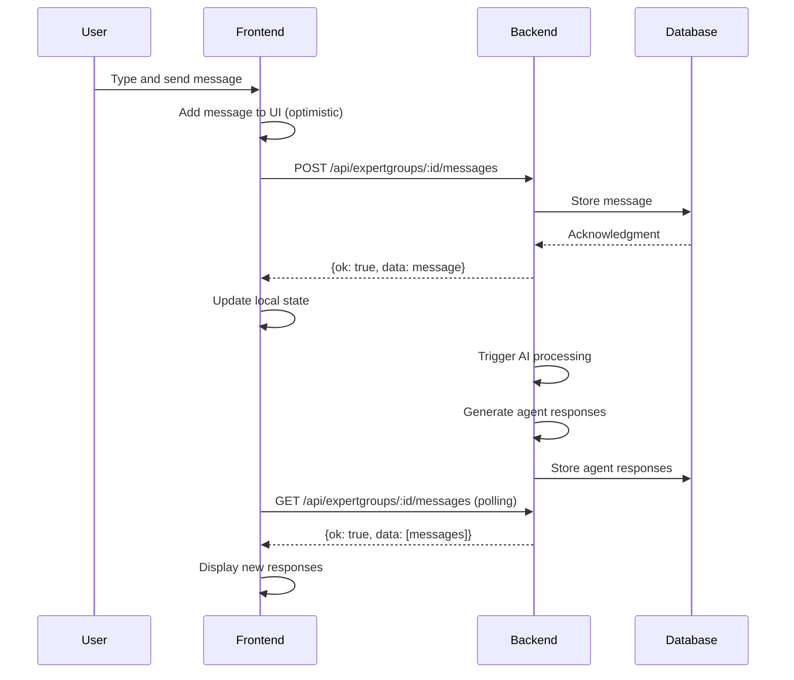
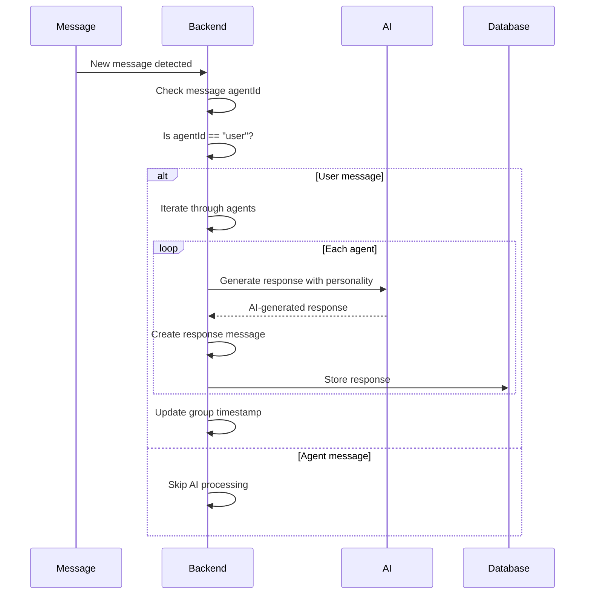

# Dashboard Backend API Design

## Project: ShizoGPT Dashboard API

## Summary

This document outlines the comprehensive RESTful API design for dashboard module communication (Features, Bugs, History) with the backend. The backend is implemented in ShizoScript using LevelDB for persistence and the built-in webserver module.

## Architecture Overview

```
┌─────────────────────────────────────────────────────────────────┐
│                        Frontend (web/)                          │
│  ┌──────────┐  ┌──────────┐  ┌──────────┐  ┌──────────┐        │
│  │ Features │  │   Bugs   │  │  History │  │  Chat    │        │
│  │  Module  │  │  Module  │  │  Module  │  │  Module  │        │
│  └──────────┘  └──────────┘  └──────────┘  └──────────┘        │
│         │            │            │            │                 │
│         └────────────┴────────────┴────────────┘                 │
│                      │                                           │
│              HTTP Polling (2s)                                   │
└──────────────────────┼───────────────────────────────────────────┘
                       │
┌──────────────────────┼───────────────────────────────────────────┐
│                  Web Server (port 13337)                        │
│  ┌──────────────────┴──────────────────┐                        │
│  │          /api/ endpoints            │                        │
│  └──────────────────┬──────────────────┘                        │
└──────────────────────┼───────────────────────────────────────────┘
                       │
┌──────────────────────┼───────────────────────────────────────────┐
│                  LevelDB Persistence                             │
│  ┌──────────┐  ┌──────────┐  ┌──────────┐                      │
│  │ features │  │  bugs    │  │  history │                      │
│  │   .db    │  │   .db    │  │   .db    │                      │
│  └──────────┘  └──────────┘  └──────────┘                      │
└───────────────────────────────────────────────────────────────────┘
```

## Polling Strategy

### Initial Load
- Frontend fetches **all entries** once on module initialization
- Returns complete dataset for immediate rendering

### Regular Updates
- Frontend polls server **every 2 seconds** for updates
- Returns only current state (full refresh)
- Backend handles all changes (AI agents add/remove/update)

### Benefits
- Simple frontend logic (no diffing needed)
- Consistent data state across modules
- Low complexity and maintenance

## API Endpoints

### Common Response Format

All responses follow this structure:

```json
{
  "ok": true/false,
  "data": { ... },      // Optional: Response data for successful requests
  "error": "..."        // Optional: Error message for failed requests
}
```

### Features Module

| Method | Endpoint | Description | Request Body | Response |
|--------|----------|-------------|--------------|----------|
| GET | `/api/features/list` | Get all features | - | `data: [feature, ...]` |
| GET | `/api/features/:id` | Get specific feature | - | `data: feature` |
| POST | `/api/features` | Create new feature | Feature object | `data: created_feature` |
| PUT | `/api/features/:id` | Update feature | Feature updates | `data: updated_feature` |
| DELETE | `/api/features/:id` | Delete feature | - | `ok: true` |

**Feature Object Structure:**
```json
{
  "id": "feature_...",
  "title": "string",
  "description": "string",
  "priority": "low|medium|high|critical",
  "category": "string",
  "status": "planned|in-progress|completed",
  "progress": 0-100,
  "targetDate": "2024-01-01",  // Optional
  "createdAt": 1234567890,
  "updatedAt": 1234567890,
  "history": [ ... ]  // Optional
}
```

### Bugs Module

| Method | Endpoint | Description | Request Body | Response |
|--------|----------|-------------|--------------|----------|
| GET | `/api/bugs/list` | Get all bugs | - | `data: [bug, ...]` |
| GET | `/api/bugs/:id` | Get specific bug | - | `data: bug` |
| POST | `/api/bugs` | Create new bug | Bug object | `data: created_bug` |
| PUT | `/api/bugs/:id` | Update bug | Bug updates | `data: updated_bug` |
| DELETE | `/api/bugs/:id` | Delete bug | - | `ok: true` |

**Bug Object Structure:**
```json
{
  "id": "bug_...",
  "title": "string",
  "description": "string",
  "priority": "low|medium|high|critical",
  "source": "user|testing|monitoring",
  "environment": "development|staging|production",
  "status": "new|investigating|fixing|verified|closed",
  "createdAt": 1234567890,
  "updatedAt": 1234567890,
  "history": [ ... ]  // Optional
}
```

### History Module

| Method | Endpoint | Description | Request Body | Response |
|--------|----------|-------------|--------------|----------|
| GET | `/api/history/list` | Get all history entries | - | `data: [entry, ...]` |
| GET | `/api/history/:id` | Get specific entry | - | `data: entry` |
| POST | `/api/history` | Create history entry | Entry object | `data: created_entry` |
| PUT | `/api/history/:id` | Update entry | Entry updates | `data: updated_entry` |
| DELETE | `/api/history/:id` | Delete entry | - | `ok: true` |

**History Entry Structure:**
```json
{
  "id": "history_...",
  "timestamp": 1234567890,
  "type": "feature|bug|chat|revert",
  "description": "string",
  "data": { ... },  // Optional: Additional data specific to entry type
  "revertAction": { ... }  // Optional: Function data for reverting
}
```

### Work Mode Module

| Method | Endpoint | Description | Request Body | Response |
|--------|----------|-------------|--------------|----------|
| GET | `/api/workmode` | Get current work mode state | - | `data: { enabled: boolean }` |
| PUT | `/api/workmode` | Update work mode state | `{ enabled: boolean }` | `data: { enabled: boolean }` |

**Work Mode Object Structure:**
```json
{
  "enabled": true/false
}
```

## Implementation Details

### Backend (ShizoScript)

**File:** `dashboard_api.shio`

**Key Components:**
1. **Database Initialization:**
   - `features_db` - LevelDB at `agent_space/dashboard/features.db`
   - `bugs_db` - LevelDB at `agent_space/dashboard/bugs.db`
   - `history_db` - LevelDB at `agent_space/dashboard/history.db`

2. **Helper Functions:**
   - `format_api_response(ok, data, error)` - Standardizes responses
   - `parse_request_body(body)` - Parses JSON from request

3. **Endpoint Implementation:**
   - All endpoints use regex patterns for ID matching
   - Error handling with try/catch blocks
   - Automatic JSON serialization

### Frontend Integration

**Polling Example (JavaScript):**
```javascript
// Initial fetch
fetch('/api/features/list')
  .then(r => r.json())
  .then(data => {
    if(data.ok) {
      window.DashboardFeatures.Store.load(data.data);
    }
  });

// Polling for updates (every 2 seconds)
setInterval(() => {
  fetch('/api/features/list')
    .then(r => r.json())
    .then(data => {
      if(data.ok) {
        // Compare and update local store
        window.DashboardFeatures.Store.sync(data.data);
      }
    });
}, 2000);
```

### Database Schema

All data is stored as JSON strings in LevelDB with the following key patterns:

- Features: `feature_<timestamp>_<hash>` → JSON
- Bugs: `bug_<timestamp>_<hash>` → JSON
- History: `history_<timestamp>_<hash>` → JSON

## Benefits of This Design

1. **Backend-Managed:** Backend controls all data changes
2. **Simple Frontend:** No complex synchronization logic needed
3. **Consistent Data:** All modules see same data state
4. **Extensible:** Easy to add new endpoints or fields
5. **Persistent:** LevelDB ensures data survives restarts
6. **Reliable:** Standardized response format

## Future Enhancements

1. **Delta Updates:** Support for only sending changed entries
2. **Filtering:** Query parameters for filtering lists
3. **Pagination:** For very large datasets
4. **Event Streaming:** WebSocket support for real-time updates
5. **Caching:** Redis/memcached for performance

## Expert Groups Message Pushing Flow

### Overview

The Expert Groups module provides a complete group chat functionality with AI agents. The backend provides endpoints for message storage and retrieval, while message processing requires additional AI implementation.

### Data Flow Architecture

```
┌─────────────────────────────────────────────────────────────────────────┐
│                         Frontend (web/expertgroups/)                    │
│  ┌──────────────────────┐  ┌──────────────────────┐                    │
│  │   User Interface     │  │   Message Polling    │                    │
│  │  (input field,       │  │   (2s interval)      │                    │
│  │   chat display)      │  │                      │                    │
│  └──────────┬───────────┘  └──────────┬───────────┘                    │
│             │                         │                                 │
│             │ POST message            │ GET messages                  │
│             ├─────────────────────────┼─────────────────┐              │
│             │                         │                 │              │
└─────────────┼─────────────────────────┼─────────────────┼──────────────┘
              │                         │                 │
    ┌─────────▼─────────┐   ┌─────────▼─────────┐  ┌──────▼──────┐
    │  Backend Server   │   │   Backend Server  │  │   Backend   │
    │  (localhost:13337 │   │  (localhost:13337 │  │   Server    │
    │   dashboard_api   │   │   dashboard_api   │  │  (AI Processing│
    │        .shio)     │   │        .shio)     │  │      )      │
    └─────────┬─────────┘   └─────────┬─────────┘  └──────┬──────┘
              │                         │                 │
    ┌─────────▼─────────┐   ┌─────────▼─────────┐  ┌──────▼──────┐
    │  LevelDB          │   │  LevelDB          │  │   LevelDB   │
    │  expertgroups.db  │   │  expertgroups.db  │  │expertgroups.db│
    └───────────────────┘   └───────────────────┘  └─────────────┘
```

### Message Pushing Workflow

#### 1. User Sending a Message



**Step-by-Step Process:**

1. **User types message** in the input field
2. **Frontend validates** the message text (non-empty, length limits)
3. **Frontend adds message** to UI immediately (optimistic update)
4. **Frontend sends POST request** to `/api/expertgroups/:groupId/messages`
5. **Backend stores message** in the group's messages array
6. **Backend triggers AI processing** (custom implementation needed)
7. **Agent responses are generated** using agent personalities
8. **Backend stores responses** to group messages array
9. **Frontend polls** for new messages every 2 seconds
10. **Frontend receives responses** via polling and updates UI

#### 2. Agent Response Generation Flow



**Backend Processing Example (ShizoScript):**

```shizo
// This would be implemented in dashboard_api.shio

// Get group and messages
group = expertgroups_db.get(expertgroup_id);
messages = group.messages;

// Get latest user message
lastMessage = messages[messages.size() - 1];

if(lastMessage.agentId == "user") {
    // Process with AI for each agent in group
    for each agent in group.agents {
        // Generate response using agent personality
        response = generate_ai_response(
            lastMessage.content,
            agent.personality,
            messages
        );
        
        // Add response to group
        message_id = "msg_" + std.date("%d-%m-%Y_%H-%M-%S") + "_" + std.random_hash();
        response_message = [
            id = message_id,
            timestamp = std.millis(),
            agentId = agent.id,
            content = response
        ];
        
        group.messages.push_back(response_message);
    }
    
    // Update timestamp
    group.updatedAt = std.millis();
    
    // Save updated group
    expertgroups_db.put(expertgroup_id, group);
}
```

### API Endpoint Reference

#### Expert Groups Message Endpoints

| Method | Endpoint | Description | Request Body | Response |
|--------|----------|-------------|--------------|----------|
| GET | `/api/expertgroups/:id/messages` | Get all messages in group | - | `data: [message, ...]` |
| POST | `/api/expertgroups/:id/messages` | Add message to group | `agentId`, `content` | `data: message` |

#### Message Object Structure

```json
{
  "id": "msg_01-Jan-2026_12-30-00_abc456",
  "timestamp": 1704069000000,
  "agentId": "user",
  "content": "Message content"
}
```

**Fields:**
- `id` (string): Unique message identifier
- `timestamp` (number): Unix timestamp in milliseconds
- `agentId` (string): ID of the message sender ("user" for human, agent ID for AI)
- `content` (string): Message text content

### Complete JavaScript Examples

#### Sending a User Message

```javascript
async function sendMessage(groupId, text) {
  // Step 1: Add user message to UI immediately
  appendMessageBubble({
    agentId: 'user',
    content: text,
    timestamp: Date.now()
  });
  
  // Step 2: Add message to backend
  try {
    const addedMessage = await window.DashboardExpertGroups.API.addMessage(groupId, {
      agentId: 'user',
      content: text
    });
    
    // Step 3: Update local state with backend response
    if (addedMessage) {
      addedMessage.timestamp = Date.now();
      // Use addedMessage instead of original for accurate ID/timestamp
    }
  } catch (e) {
    console.error('Error adding message:', e);
    // Step 4: Handle error (e.g., show error UI)
    showNotification('Failed to send message: ' + e.message, 'error');
  }
}

// Usage example
const groupId = 'expertgroup_01-Jan-2026_12-00-00_xyz123';
sendMessage(groupId, 'Hello agents! What are we working on today?');
```

#### Polling for New Messages

```javascript
// Start polling (2-second interval)
let lastMessageTimestamp = null;

setInterval(async () => {
  if (!activeGroupId) return;
  
  try {
    const messages = await window.DashboardExpertGroups.API.getMessages(activeGroupId);
    
    if (!messages || !messages.length) return;
    
    // Check if there are new messages from backend
    const lastBackendMessage = messages[messages.length - 1];
    const hasNewMessages = !lastMessageTimestamp || 
                          (lastBackendMessage && 
                           lastBackendMessage.timestamp > lastMessageTimestamp);
    
    if (hasNewMessages) {
      // Update state
      messagesState = messages;
      lastMessageTimestamp = lastBackendMessage.timestamp;
      
      // Re-render messages to show new backend messages
      renderMessages();
    }
  } catch (e) {
    console.error('Error polling messages:', e);
  }
}, 2000); // Poll every 2 seconds
```

#### Complete Message Flow Example

```javascript
async function completeMessageFlow() {
  const groupId = 'expertgroup_01-Jan-2026_12-00-00_xyz123';
  
  // 1. Send user message
  const userMsg = await window.DashboardExpertGroups.API.addMessage(groupId, {
    agentId: 'user',
    content: 'Hello agents! What are we working on today?'
  });
  
  console.log('User message sent:', userMsg);
  
  // 2. Poll for responses (after 2 seconds)
  setTimeout(async () => {
    const messages = await window.DashboardExpertGroups.API.getMessages(groupId);
    console.log('Latest messages:', messages);
    
    // Display agent responses
    messages.forEach(msg => {
      if (msg.agentId !== 'user') {
        console.log(`Agent response: ${msg.content}`);
      }
    });
  }, 2000);
  
  // 3. Continue polling for additional responses
  const pollingInterval = setInterval(async () => {
    const messages = await window.DashboardExpertGroups.API.getMessages(groupId);
    const lastBackendMessage = messages[messages.length - 1];
    
    if (lastBackendMessage && lastBackendMessage.timestamp > lastMessageTimestamp) {
      console.log('New message received:', lastBackendMessage.content);
      lastMessageTimestamp = lastBackendMessage.timestamp;
      
      // Stop polling after 10 seconds
      clearInterval(pollingInterval);
    }
  }, 2000);
}
```

### Backend Implementation Notes

#### Adding Message Processing

To implement AI-powered message processing, add the following to `dashboard_api.shio`:

1. **Create a message processing function:**

```shizo
// Message processing helper
process_messages(expertgroup_id) {
    group = expertgroups_db.get(expertgroup_id);
    messages = group.messages;
    
    if(!messages || messages.size() == 0)
        return;
    
    // Check for new user messages
    lastMessage = messages[messages.size() - 1];
    
    if(lastMessage.agentId == "user") {
        // Process with AI for each agent
        agents = group.agents || [];
        
        for(i = 0; i < agents.size(); i++) {
            agent = agents[i];
            
            // Generate response using agent personality
            response = generate_ai_response(
                lastMessage.content,
                agent.personality,
                messages
            );
            
            // Create response message
            message_id = "msg_" + std.date("%d-%m-%Y_%H-%M-%S") + "_" + std.random_hash();
            response_message = [
                id = message_id,
                timestamp = std.millis(),
                agentId = agent.id,
                content = response
            ];
            
            group.messages.push_back(response_message);
        }
        
        // Update timestamp
        group.updatedAt = std.millis();
        
        // Save updated group
        expertgroups_db.put(expertgroup_id, group);
    }
}
```

2. **Call processing after message addition:**

```shizo
// In POST /api/expertgroups/:id/messages endpoint
// ... after saving message ...
process_messages(expertgroup_id);
```

### Error Handling

#### Common Message Errors

| Error | Status | Description |
|-------|--------|-------------|
| `Expert group not found` | 404 | Group ID doesn't exist |
| `Invalid request body` | 400 | JSON parsing failed |
| `Not enabled` | 503 | LevelDB not initialized |
| `Empty content` | 400 | Message content is empty |

#### Error Response Format

```json
{
  "ok": false,
  "error": "Error message"
}
```

#### JavaScript Error Handling

```javascript
async function sendMessageWithRetry(groupId, text) {
  let retries = 3;
  
  while (retries > 0) {
    try {
      const result = await window.DashboardExpertGroups.API.addMessage(groupId, {
        agentId: 'user',
        content: text
      });
      
      return result;
    } catch (e) {
      console.error('API Error:', e);
      retries--;
      
      if (retries === 0) {
        showNotification('Failed to send message after 3 attempts', 'error');
        throw e;
      }
      
      // Wait before retry
      await new Promise(resolve => setTimeout(resolve, 1000));
    }
  }
}
```

### Best Practices

#### 1. Always Add to UI First

```javascript
// Good: Optimistic UI update
appendMessageBubble({ agentId: 'user', content: text, timestamp: Date.now() });
await window.DashboardExpertGroups.API.addMessage(groupId, { ... });
```

#### 2. Handle Timestamp Discrepancies

```javascript
// Backend timestamps may differ from client timestamps
// Always use backend timestamp for message ordering
if (addedMessage) {
  addedMessage.timestamp = Date.now(); // Use current time for ordering
}
```

#### 3. Poll with Deduplication

```javascript
// Only update when new messages exist
const hasNewMessages = lastBackendMessage.timestamp > lastMessageTimestamp;
```

#### 4. Validate Message Content

```javascript
function validateMessage(message) {
  return message &&
         message.agentId &&
         message.content &&
         typeof message.content === 'string' &&
         message.content.length <= 10000; // 10KB limit
}
```

## Error Handling

All errors return:
```json
{
  "ok": false,
  "error": "descriptive error message"
}
```

Common errors:
- Feature/Bug/History not found (404)
- Invalid request body (400)
- Database error (500)
